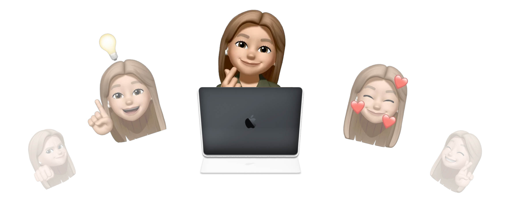

 

  

###

<h1 align="center">Hey  I'm Katya!</h1>

  

  
  
  

<h3 align="left"> ✌ About me:</h3>

###

I'm a Computer Science student at RTU MIREA (Moscow) and an aspiring <b>Go backend developer</b>. I love building things end-to-end: REST APIs, databases, bots and the frontends that sit on top of them.

Outside of coursework I spend a lot of time on hackathons and AI/ML competitions — it's the fastest way I know to learn a new stack under pressure and ship something that actually works.

Currently looking for a <b>Junior / Intern Golang Backend</b> position — let's talk!  - 🐹 Writing backend in Go: REST APIs, goroutines & channels, PostgreSQL, Docker; - 🏆 6th place out of 254 teams at Purple Hack (MIPT), Ingosstrakh case; - 🎯 Semifinalist of Yandex «Баттл вузов» with the RTU MIREA team; - 🧠 Tabular ML & computer vision in competitions (CatBoost / LightGBM, UNet segmentation); - 🎓 Bachelor's student in Computer Science at RTU MIREA.

<h3 align="left">🛠 My projects:</h3>

- [**Golandia**](https://github.com/katshuuu/golandia) — web platform for learning Go: React SPA, Go REST API, PostgreSQL, isolated Go sandbox and an LLM tutor
- [**FS-Emulator**](https://github.com/katshuuu/fs-emulator) — single-file virtual filesystem emulator
- [**Flora Mind**](https://github.com/katshuuu/floramind_project) — AI bouquet-generation web service (team project) + its [Telegram bot](https://github.com/katshuuu/FloraMind_chat)
- [**Tender Hack — MosZapros**](https://github.com/katshuuu/moszapros) — personalized product service for the Moscow suppliers portal (fullstack: backend, frontend, DB, design)

<h3 align="left">🚀 My tech stack:</h3>

**Backend** 
     

**Databases & DevOps** 
     

**Frontend** 
    

**ML & Data** 
      

 

<h3 align="left">🍇 My statistics:</h3>

 
 

**Code Cycle** 

&nbsp;&nbsp;&nbsp;&nbsp;&nbsp;

&nbsp;&nbsp;&nbsp;&nbsp;&nbsp;
 

